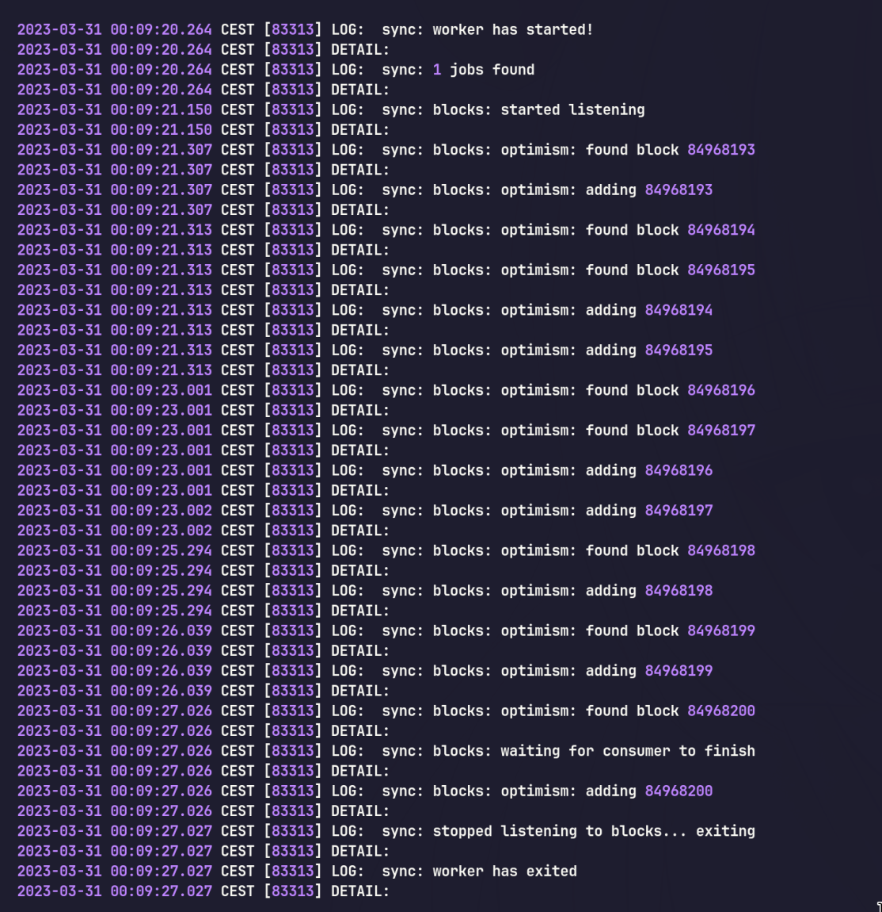

# pg_chainsync - watch blockchain inside PostgreSQL

> Proof of Concept - expect bugs and breaking changes.

pg_chainsync adds ability to watch blockchain blocks, events and more directly inside your PostgreSQL instance. The extension does not enforce any custom schema for your table and let's you use custom handlers that you adjust for your specific use-case.

The extension is written using [pgrx](https://github.com/tcdi/pgrx) in Rust.

## Usage

```sql
CREATE EXTENSION pg_chainsync;
```

### Worker lifecycle

```sql
-- Restart your worker on-demand
SELECT chainsync.restart();

-- Stops the worker
SELECT chainsync.stop();
```

### Watching new blocks
> This scenario assumes there exists blocks table with number and hash column

```sql
-- This is your custom handler that inserts new blocks to your table
CREATE FUNCTION custom_block_handler(block chainsync.Block) RETURNS blocks
AS $$
INSERT INTO blocks (number, hash) -- Inserting into your custom blocks table
VALUES (block.number, block.hash)
RETURNING *
$$
LANGUAGE SQL;

-- The arguments are chain id, websocket url and name of the handler function
SELECT chainsync.add_blocks_job(10, 'wss://provider-url', 'custom_block_handler');

-- Restart worker (or database) to start the job
SELECT chainsync.stop();
```

For the optimal performance your handler function should meet the conditions to be [inlined](https://wiki.postgresql.org/wiki/Inlining_of_SQL_functions).

Here is the complete log output, for the testing the number of fetched blocks has been limited to display the full lifecycle.



The usage examples were run on PotsgreSQL 15.

## Installation

> The extension is currently in Proof of Concept stage and does not provide instructions how to install it. Refer to the pgx documentation to see how to run the extension that uses worker if you are interested in trying it out.


## License

```LICENSE
MIT License

Copyright (c) 2023 Kamil Jakubus and contributors

Permission is hereby granted, free of charge, to any person obtaining a copy
of this software and associated documentation files (the "Software"), to deal
in the Software without restriction, including without limitation the rights
to use, copy, modify, merge, publish, distribute, sublicense, and/or sell
copies of the Software, and to permit persons to whom the Software is
furnished to do so, subject to the following conditions:

The above copyright notice and this permission notice shall be included in all
copies or substantial portions of the Software.

THE SOFTWARE IS PROVIDED "AS IS", WITHOUT WARRANTY OF ANY KIND, EXPRESS OR
IMPLIED, INCLUDING BUT NOT LIMITED TO THE WARRANTIES OF MERCHANTABILITY,
FITNESS FOR A PARTICULAR PURPOSE AND NONINFRINGEMENT. IN NO EVENT SHALL THE
AUTHORS OR COPYRIGHT HOLDERS BE LIABLE FOR ANY CLAIM, DAMAGES OR OTHER
LIABILITY, WHETHER IN AN ACTION OF CONTRACT, TORT OR OTHERWISE, ARISING FROM,
OUT OF OR IN CONNECTION WITH THE SOFTWARE OR THE USE OR OTHER DEALINGS IN THE
SOFTWARE.
```
